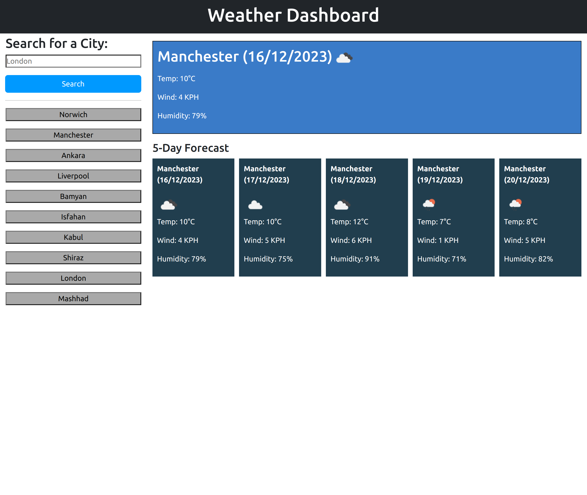

# Weather Dashboard

This is a weather app that gives you weather conditions for the current time and for the following 5 days. The
information included are temperature, wind speed, humidity, and weather condition (displayed with an icon). You will be
able to see a history of the last 10 cities that were searched on the app in the form of buttons.

The app has been designed based on principles of responsiveness, and uses the OpenWeatherMap api.

## Screenshot

## Webpage link

https://yrezvani.github.io/weather-dashboard/
